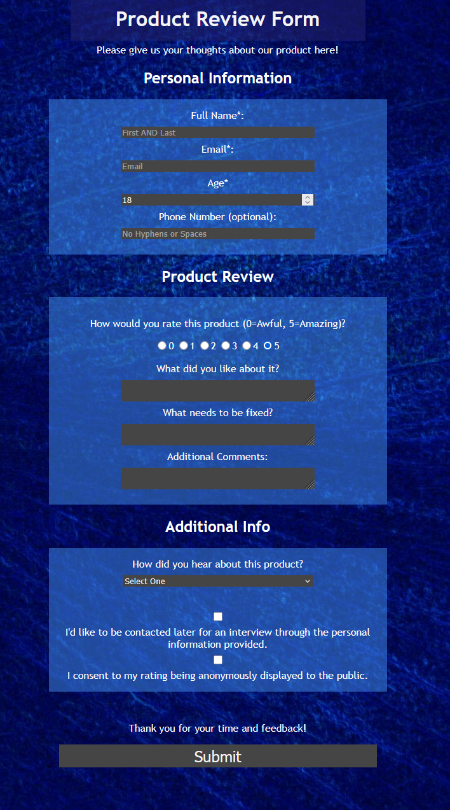

<h1>Product Review Form Demo</h1>

This is my submission for the first project in the Responsive Web Design coursework in freeCodeCamp.org, "Survey Form." It is meant to show off the basic functionalities of HTML and CSS taught through the four courses that precede it.

<h2>Screenshot:</h2>

<h2>Live Demo</h2>

A live demo can be played <a href="https://craftedbychase.github.io/simple-product-review-demo/">here.</a>
